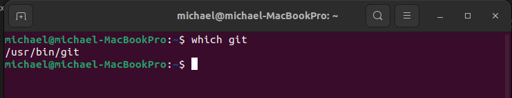
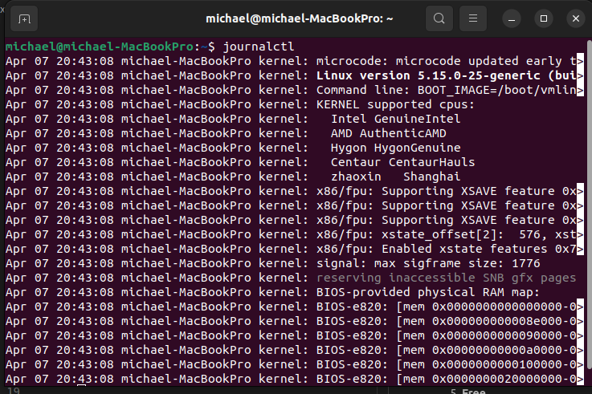
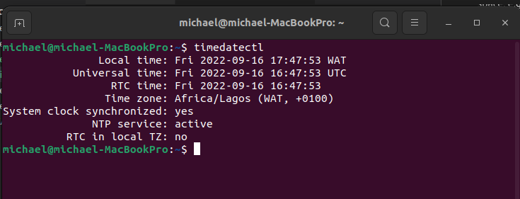
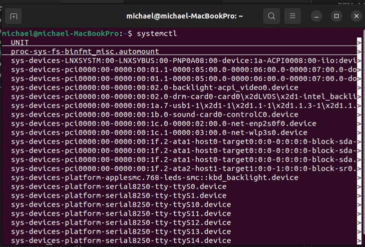
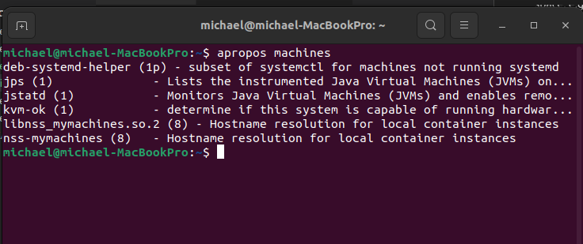
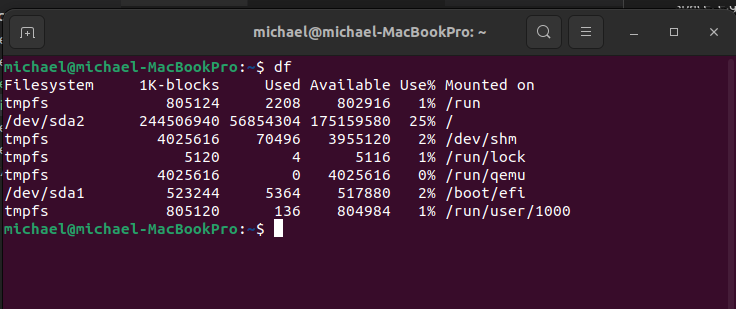

# Linux Commands and their uses!

1. **Which comand**

This command is used to locate the executable file associated with the given command by searching it in the path enivironmental variable. e.g _which git_

2. **stat**

This command gives information about the file and filesystem. e.g _stat machines_.

3. **Grep**

This command searches through the file looking for matches to the pattern specified. e.g _grep  command_

4. **Journalctl**

This command is used to view systemd, kernel and journal logs.

5. **Free**

This command outputs a summary of RAM usage, including total, used, free, shared, and available memory and swap space. e.g _free_

6. **Top**

This command shows a real-time view of running processes in linux and displays kernel-managed tasks. e.g _top_

7. **Timedatectl**

This command may be used to query and change the system clock and its settings, and enable or disable time synchronization services. e.g _timedatectl_

8. **Systemctl**

This command manages both system and services configurations, enabling administrators to manage the OS and control the status of services.

9. **Apropos**

This command helps the user when they don't remember the exact command but know a few keywords related to the command that defines its uses or functionality.

10. **Df**

This command is used to display the disk space used in the file system.

